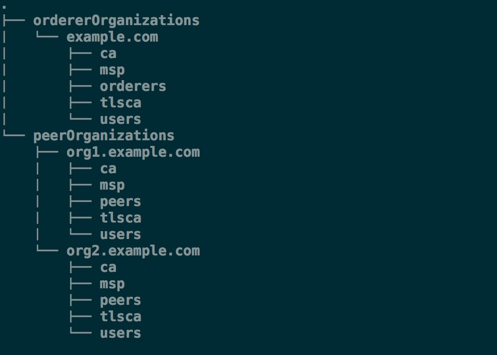
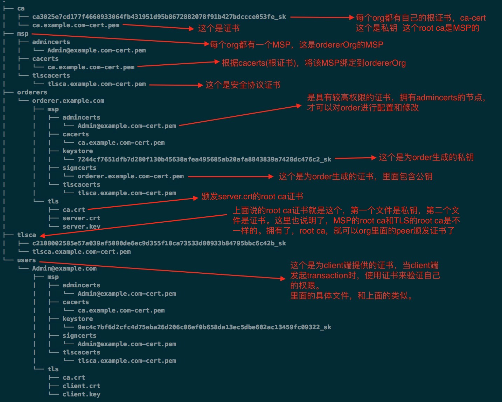

# Building Your First Network 步骤详解介绍

## build your first network (BYFN) 包含的内容

第一个Hyperledger Fabric network由下面内容组成：

*  4 个peers，代表2个不同的organizations。
*  1 个orderer 节点。
*  启动1个 container， 执行脚本，将peers加入Channel，部署和实例化Chaincode，并根据部署的Chaincode，驱动transactions的执行。

## 准备工作
1. https://github.com/xiaofateng/knowledge-without-end/blob/master/区块链/Hyperledger/Hyperledger%20Fabric%20源码和镜像下载.md
2. 修改`fabric-samples/first-network`目录下的`docker-compose-cli.yaml`日志级别为debug

```c
cli:
  container_name: cli
  image: hyperledger/fabric-tools:$IMAGE_TAG
  tty: true
  stdin_open: true
  environment:
    - GOPATH=/opt/gopath
    - CORE_VM_ENDPOINT=unix:///host/var/run/docker.sock
    - CORE_LOGGING_LEVEL=DEBUG
    #- CORE_LOGGING_LEVEL=INFO
```

## Crypto Generator

我们将使用`cryptogen`工具（这个工具只是在测试的时候使用，线上一般使用Fabric CA等）为我们的各种network entitie（网络实体）生成加密资料（x509证书和签名密钥）。 这些`certificates`（证书）是身份的代表，它们允许在我们的实体，进行通信和transact时进行签名/验证身份。

`Cryptogen`使用包含网络拓扑的文件 - `crypto-config.yaml`，并允许我们为Organizations和属于这些Organizations的组件生成一组`certificates` and `keys`（证书和密钥）。

每个Organizations都配备了一个独特的根证书（`ca-cert`），将特定的组件（peers and orderers）绑定到该Org。 通过为每个Org分配一个唯一的CA证书，我们正在模拟一个典型的网络，其中一个Member将使用自己的Certificate Authority（证书授权）。 Hyperledger Fabric中的Transactions和通信由实体的private key（私钥，存储的文件名是 `keystore`）签名，然后通过public key（公钥，存储的文件名是 `signcerts`）进行验证。

你会注意到这个文件中的 `count` 变量。我们用它来指定每个Organization的peers数量; 在我们的案例中，每个Organization有两个peers。

在运行该工具之前，让我们快速浏览一下`crypto-config.yaml`的代码片段。 特别注意OrdererOrgs header下的`“Name”`, `“Domain”` 和 `“Specs”`：

```c
OrdererOrgs:
#---------------------------------------------------------
# Orderer
# --------------------------------------------------------
- Name: Orderer
  Domain: example.com
  CA:
      Country: US
      Province: California
      Locality: San Francisco
  #   OrganizationalUnit: Hyperledger Fabric
  #   StreetAddress: address for org # default nil
  #   PostalCode: postalCode for org # default nil
  # ------------------------------------------------------
  # "Specs" - See PeerOrgs below for complete description
# -----------------------------------------------------
  Specs:
    - Hostname: orderer
# -------------------------------------------------------
# "PeerOrgs" - Definition of organizations managing peer nodes
 # ------------------------------------------------------
PeerOrgs:
# -----------------------------------------------------
# Org1
# ----------------------------------------------------
- Name: Org1
  Domain: org1.example.com
  EnableNodeOUs: true
```

网络实体的命名约定如下 -  `“{{.Hostname}}.{{.Domain}}”`。 因此，使用我们的ordering node作为参考点，我们看到一个名为 - `orderer.example.com`的ordering node，它与`Orderer`的`MSP ID`绑定。 

运行`cryptogen`工具后，生成的证书和密钥将被保存到名为`crypto-config`的文件夹中。

### 执行`cryptogen`命令

下面执行命令(假设当前路径是`hyperledger/fabric-samples/first-network`)：

`../../bin/cryptogen generate --config=./crypto-config.yaml`


执行命令后，为各个节点生成的证书如下：

`hyperledger/fabric-samples/first-network/crypto-config`目录的层级结构如下：




目录`/hyperledger/fabric-samples/first-network/crypto-config/ordererOrganizations/example.com`的详细结构如下：



peerOrganizations目录的内容与上面类似。


## Configuration Transaction Generator
	
`configtxgen tool` 创建4个配置artifacts：

* orderer `genesis block`
* channel `configuration transaction`
* 两个 `anchor peer transactions`，每个Org一个。

orderer block是ordering service的创世区块。

在 Channel 创建的时候，channel configuration transaction 文件广播到 orderer（因为orderer负责创建Channel）。

anchor peer transactions, 指定在这个Channel上，每个Org的Anchor Peer on this channel。

`Configtxgen`工具使用 - `configtx.yaml`文件 - 它包含示例网络的定义信息。 **有三个成员 - 一个`Orderer Org`（OrdererOrg，Orderer也是一个专门的org）和两个`Peer Orgs`（`Org1`＆`Org2`），**每个管理和维护两个peer节点。 **该文件还指定了由两个Peer Orgs组成的联盟 - `SampleConsortium`。（联盟是org组成的）**

 请特别注意本文件顶部的`“Profiles”`部分。 你会注意到我们有两个独特的headers。 一个用于orderer genesis block - `TwoOrgsOrdererGenesis` 。一个用于我们的Channel - `TwoOrgsChannel`。

这些headers非常重要，因为我们将在创建artifacts时将它们作为参数传递给它们。

请注意，我们的`SampleConsortium`在system-level profile中定义，然后由我们的channel-level profile引用。 channel存在于一个联盟的范围内，所有联盟必须在整个网络范围内进行界定。


该文件还包含两个值得注意的附加规范。 首先，我们为每个Peer Org指定Anchor peers（`peer0.org1.example.com`＆`peer0.org2.example.com`）。 其次，我们指向每个成员的MSP目录的位置，这反过来又允许我们将每个组织的根证书存储在`orderer genesis block`。 这是一个重要的概念。 现在任何与`ordering service`通信的网络实体都可以验证其数字签名。

### 执行`configtxgen`命令生成`orderer genesis block`

首先指定`configtx.yaml`文件的位置，目前好像不支持在命令中指定。
`export FABRIC_CFG_PATH=$PWD`

然后执行命令：

```c
../../bin/configtxgen -profile TwoOrgsOrdererGenesis -outputBlock ./channel-artifacts/genesis.block
```

生成的`orderer genesis block`存储在了`./channel-artifacts/`目录下。

### 执行`configtxgen`命令创建`Channel Configuration Transaction`

#### 创建Channel

首先设置CHANNEL_NAME变量，或者在命令中指定
`export CHANNEL_NAME=mychannel`

然后执行命令：

```c
../../bin/configtxgen -profile TwoOrgsChannel -outputCreateChannelTx ./channel-artifacts/channel.tx -channelID $CHANNEL_NAME
```

channel.tx artifact 包含了我们sample channel的定义。
生成的 `channel.tx` 在`./channel-artifacts`目录下面。

#### 指定Anchor peer

`export CHANNEL_NAME=mychannel`

为 Org1 指定 Anchor peer

```c
../../bin/configtxgen -profile TwoOrgsChannel -outputAnchorPeersUpdate ./channel-artifacts/Org1MSPanchors.tx -channelID $CHANNEL_NAME -asOrg Org1MSP
```

为 Org2 指定 Anchor peer

```c
../../bin/configtxgen -profile TwoOrgsChannel -outputAnchorPeersUpdate ./channel-artifacts/Org2MSPanchors.tx -channelID $CHANNEL_NAME -asOrg Org2MSP
```

最终channel-artifacts目录文件内容如下：


## Start the network（启动网络）

我们将使用脚本启动我们的网络。
docker-compose 文件引用了 我们之前下载的images,
并且使用之前生成的`genesis.block`， bootstraps（自举启动）orderer。

首先，启动网络的命令:
`docker-compose -f docker-compose-cli.yaml up -d`

如果想要查看网络的实时日志，就不要使用 -d 选项。

启动后，会有5个 docker containers，如下图：


CLI container 会坚持闲置1000秒，当它没有后，可以通过下面的命令重启：
`docker start cli`


